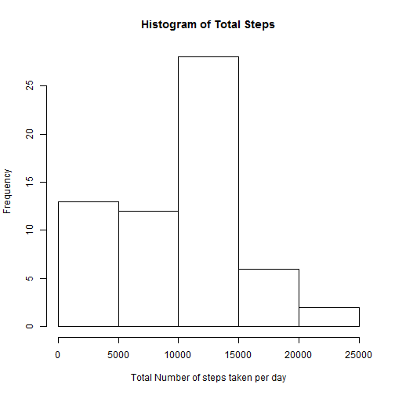
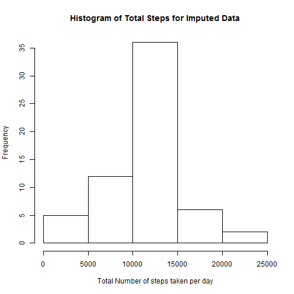
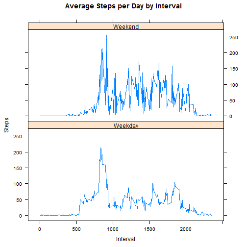

## About

This was the first project for the **Reproducible Research** course in Coursera's Data Science specialization track. The purpose of the project was to answer a series of questions using data collected from a [FitBit](http://en.wikipedia.org/wiki/Fitbit).

## Data

### The data for this assignment was downloaded from the course web site:

* Dataset: [Activity monitoring data](https://d396qusza40orc.cloudfront.net/repdata%2Fdata%2Factivity.zip) [52K]

### The variables included in this dataset are:

* **steps** : Number of steps taking in a 5-minute interval (missing values are coded as NA)

* **date** : The date on which the measurement was taken in YYYY-MM-DD format

* **interval** : Identifier for the 5-minute interval in which measurement was taken

The dataset is stored in a comma-separated-value (CSV) file and there are a total of 17,568 observations in this dataset.


## Loading and preprocessing the data
The following piece of code is required to read the file and load the data into R.
The data is then processed to clean any missing values from 'steps' column.


```r
if(!file.exists('activity.csv')){
    unzip('activity.zip')
}
act.data <- read.csv("activity.csv",na.strings = "NA", stringsAsFactors=FALSE)
```


### What is mean total number of steps taken per day?
This part of the code deals with plotting a histogram of the total number of steps taken per day. Then calculate the mean and median of this total.

```r
total.steps <- tapply(act.data$steps, act.data$date, sum, na.rm = TRUE)
hist(total.steps, xlab="Total Number of steps taken per day", main="Histogram of Total Steps")
```

 

```r
mn <- mean(total.steps)
md <- median(total.steps)
```
The Mean is **9354.23** and the Median is **10395** 

### What is the average daily activity pattern?
This part of the code deals with plotting a time series plot of the 5-minute interval and the average number of steps taken which is averaged accross all days.


```r
steps.by.interval <- aggregate(steps ~ interval, act.data, mean)
plot(steps.by.interval$interval, steps.by.interval$steps, type="l", xlab="Interval", ylab="Number of Steps",main="Average Number of Steps per Day by Interval")
```

 

### Which 5-minute interval, on average across all the days in the dataset, contains the maximum number of steps?

```r
max.steps.interval <- steps.by.interval[which.max(steps.by.interval$steps),"interval"]
```

The 5-minute interval which contains the maximum number of steps is **835**

## Imputing missing values

Calculating the total number of missing values in the dataset.


```r
missing.vals <- sum(!complete.cases(act.data))
```

The total number of missing values in the dataset is **2304**

Checking the data to find which columns has **'NA'** values.


```r
summary(act.data)
```

```
##      steps            date              interval     
##  Min.   :  0.00   Length:17568       Min.   :   0.0  
##  1st Qu.:  0.00   Class :character   1st Qu.: 588.8  
##  Median :  0.00   Mode  :character   Median :1177.5  
##  Mean   : 37.38                      Mean   :1177.5  
##  3rd Qu.: 12.00                      3rd Qu.:1766.2  
##  Max.   :806.00                      Max.   :2355.0  
##  NA's   :2304
```

Impute the missing values in **steps** column. This is done by replacing the missing values of **steps** with the **mean of the steps** for that time interval for all the days.


```r
imputed.act.data <- transform(act.data, steps = ifelse(is.na(act.data$steps), 
                    steps.by.interval$steps[match(act.data$interval, 
                    steps.by.interval$interval)], act.data$steps))
```

### Plotting a histogram of the total number of steps taken each day.


```r
total.imputed.steps <- tapply(imputed.act.data$steps,imputed.act.data$date,sum)
hist(total.imputed.steps, xlab="Total Number of steps taken per day", main="Histogram of Total Steps for Imputed Data")
```

 

### Now comparing the mean and median of the original data and the imputed data.


```r
im.mn <- mean(total.imputed.steps)
im.md <- median(total.imputed.steps)
```

The original mean total number of steps taken per day is **9354.23**

Whereas the imputed mean total number of steps taken per day is **10766.19**

The original median total number of steps taken per day is **10395**

Whereas the imputed median total number of steps taken per day is **10766.19**

Seems like Imputing the missing data has **Increased** the average number of steps. 

## Are there differences in activity patterns between weekdays and weekends?

Add a factor column to the imputed data to specify whether a day is a Weekday or Weekend.


```r
imputed.act.data$date <- strptime(imputed.act.data$date, "%Y-%m-%d")
imputed.act.data$day.type = ifelse(weekdays(imputed.act.data$date) == c("Sunday","Saturday"), "Weekend", "Weekday")
imputed.act.data <- transform(imputed.act.data, day.type = as.factor(day.type))
```

Make a panel plot to compare average number of steps taken, averaged across all weekday days or weekend days to compare the average steps taken in a Weekday or Weekend for all the available intervals.


```r
steps.by.interval.compare <- aggregate(steps ~ interval + day.type, imputed.act.data, mean)
xyplot(steps.by.interval.compare$steps ~ steps.by.interval.compare$interval|steps.by.interval.compare$day.type, main="Average Steps per Day by Interval",xlab="Interval", ylab="Steps",layout=c(1,2), type="l")
```

 


